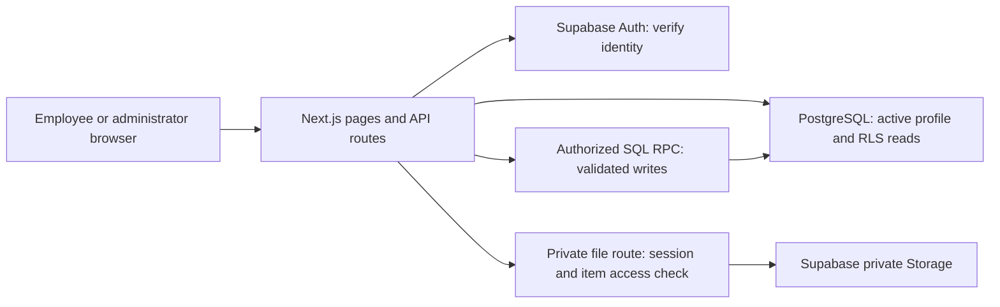
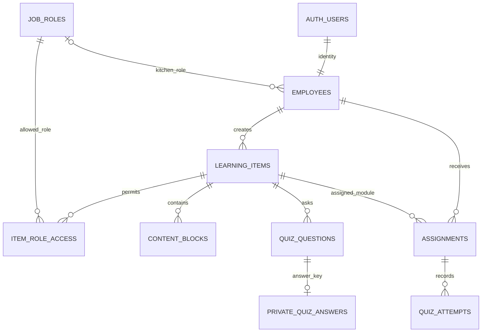

# Alimentaria Mexicana LMS — technical briefing

Prepared 17 September 2026. Target pilot date: 26 October 2026.

This describes the implementation in this repository, not a proposed future product. Design rationale below explains the choices supported by the code and the original V1 brief. It does not imply that every alternative was benchmarked. The system is a functional, single-restaurant pilot with launch work outstanding, not an independently security-certified or production-hardened enterprise LMS.

## 1. What to say at the meeting

“We have a React and TypeScript LMS built on Next.js, using Supabase for authentication, PostgreSQL, and private file storage. Administrators create employees and training; employees complete assigned, role-authorized content and optional quizzes; management sees persistent completion history. Permissions are checked both in the application and the database. The core workflow has passed desktop and mobile-viewport integration tests. We still need production deployment, verified recovery email, backup restoration, approved content, and a review of the gaps documented here.”

The important boundary is `/pilot`: this is the persistent application. The inherited `/employee`, `/manager`, and marketing/demo routes contain fictional records and browser-local demo state. Operational screens, certificates, analytics and similar demo features are not implemented production LMS capabilities.

## 2. Exact stack and its purpose

Versions below come from `package-lock.json`, not a claim that these are the latest available versions. `npm ci` installs the locked dependency graph.

| Layer                 | Implemented technology                                       | Why it is here / tradeoff                                                                                                                                                                                        |
| --------------------- | ------------------------------------------------------------ | ---------------------------------------------------------------------------------------------------------------------------------------------------------------------------------------------------------------- |
| Application runtime   | Next.js 16.3.4, App Router, native Next build with webpack   | Pages, layouts, server rendering and API routes in one deployable application. Reuses the React foundation and targets Vercel without introducing a separate API service. Framework upgrades require care.       |
| UI                    | React / React DOM 19.2.8                                     | Composable forms, authoring controls and training interactions. Interactive state stays in small client components.                                                                                              |
| Language              | TypeScript 5.9.3                                             | Shared domain types and compile-time checking across server and client. Types do not validate incoming HTTP requests or database results at runtime.                                                             |
| Styling               | Tailwind CSS 4.2.1 plus custom CSS                           | Retains the existing project tooling and design tokens. The pilot itself primarily uses semantic `pilot-*` CSS classes in `app/pilot/pilot.css`, rather than being a utility-class-only UI.                      |
| Identity              | Supabase Auth                                                | Password identity, session tokens and recovery primitives are managed by an established service. There is no application password table. Configuration and recovery delivery still require operational testing.  |
| Database              | Hosted Supabase PostgreSQL                                   | Relational constraints, transactions, row locks and Row Level Security suit employees, assignments and attempts. The exact hosted PostgreSQL engine version was not recorded in this review.                     |
| Server integration    | `@supabase/ssr` 0.12.7; `@supabase/supabase-js` 2.116.0      | Request-scoped cookie sessions, authorized database queries and named SQL RPCs. No Prisma, Drizzle or separate ORM is installed.                                                                                 |
| File storage          | Supabase Storage, private `pilot-content` bucket             | Keeps confidential images/documents/videos outside publicly served assets. The application checks access before returning bytes.                                                                                 |
| Input validation      | Zod 4.5.4                                                    | Validates HTTP payloads and editor drafts at runtime, including UUIDs, lengths, roles and quiz choices. Database enforcement remains necessary because authenticated callers can invoke permitted RPCs directly. |
| Unit/database testing | Vitest 5.0.0; PGlite 0.5.8                                   | Runs validation and actual migration SQL in an embedded PostgreSQL environment. Supabase Auth/Storage stand-ins mean this is not a complete hosted-service substitute.                                           |
| Browser testing       | Playwright 1.63.0                                            | Exercises real UI, HTTP routes and hosted services. Windows runs used installed Microsoft Edge. Mobile is Chromium viewport emulation, not physical iPhone/Safari testing.                                       |
| Code hygiene          | ESLint 9.39.4; Prettier 3.9.6                                | Consistent code style and static checks. Neither proves correctness or security.                                                                                                                                 |
| Planned hosting       | Vercel, configured in `vercel.json`                          | Native Next deployment with `npm ci` and `npm run build:pilot`. Configuration exists; no public Vercel deployment has been verified.                                                                             |
| Local runtime         | Node requirement >=22.13; verified machine used Node 24.18.0 | Runs Next, scripts and tests. Pin the deployment runtime during release setup.                                                                                                                                   |

Inherited dependencies include Lucide React 1.28.0, Recharts 3.10.1 and `qrcode.react` 4.2.0, primarily serving the demo's icons/charts/QR flows. The older demo runtime remains: vinext 0.0.50, Vite 8.0.13 and Wrangler 4.92.0. Do not describe that Cloudflare Worker runtime as the verified production pilot runtime.

**Command caveat:** `npm run dev`, `build`, `start` and `deploy` still target the retained demo toolchain. Use `dev:pilot`, `build:pilot` and `start:pilot` for the LMS. Simplifying these defaults is sensible after the checkpoint, but this snapshot preserves current behavior.

## 3. Architecture and request flow

This is one application with a managed backend. It has no microservices, message queue, Redis cache, background job system or AI service. That keeps the pilot's deployment and failure modes smaller. The tradeoff is reliance on Supabase availability and some Supabase-specific Auth/RLS/Storage integration, even though the core records and SQL remain PostgreSQL-based.

An ordinary request verifies identity with Supabase Auth and loads the employee's current active profile. Server-rendered pages query with that user's session, so database RLS applies. Interactive forms post to same-origin Next route handlers. Those handlers check the session, application role and payload, then invoke a named database function using the user's session. The database checks authorization again and controls the write.

The service key bypasses normal RLS and must stay server-only. Runtime uses are Auth administration and private file transport; privileged bootstrap/test tooling also uses it. Normal business reads and writes do not use it. Losing this key would be serious regardless of the quality of the RLS rules.

## 4. Why a relational model

The relationships are stable and important: an assignment belongs to an employee and training module; an attempt belongs to an assignment; allowed roles belong to a content item. Foreign keys prevent dangling references. Unique constraints prevent duplicate assignments. Transactions avoid half-saved modules and half-recorded completions.

The design uses UUID primary keys and timezone-aware timestamps. UUIDs are identifiers, not authorization. A person who learns a valid item UUID still needs permission to read it.

There are eight application tables in `public`, one answer table in `private`, plus Supabase-managed Auth and Storage tables. RLS is enabled on all nine application tables. One restaurant uses one database/project; there is no organization/tenant discriminator or multi-tenant isolation model.

The diagram abbreviates some relationships: `assigned_by` is another employee reference, and attempts also store `employee_id`. Each normally authored quiz question has an answer row; the question foreign key alone does not guarantee that every possible privileged database insert supplies an answer.

## 5. Table-by-table design

| Table                  | Main fields and rules                                                                                                    | Rationale and limitation                                                                                                                                                                                                                                                                                                                                                                        |
| ---------------------- | ------------------------------------------------------------------------------------------------------------------------ | ----------------------------------------------------------------------------------------------------------------------------------------------------------------------------------------------------------------------------------------------------------------------------------------------------------------------------------------------------------------------------------------------- |
| `job_roles`            | UUID, unique name; five seeded roles                                                                                     | Separates job function from application authority. “Prep Cook” never inherently means administrator. One role per employee is simple but cannot represent someone working several stations or temporary role memberships. No role-management UI yet.                                                                                                                                            |
| `employees`            | ID references `auth.users`; names, unique email, `app_role`, nullable `job_role_id`, active flag, station, creation time | Extends identity with LMS permissions and operational profile without storing passwords. An Auth trigger creates an inactive profile and synchronizes email updates. Empty initial names allow staged provisioning. No employment history, profile change audit or multiple restaurant memberships.                                                                                             |
| `learning_items`       | Kind TRAINING/SOP; title, description, category, status, restriction flag, duration, pass mark, creator, timestamps      | Training and SOPs share content, authoring and restrictions, so one parent avoids duplicating those systems. Their behavior differs: SOPs are references; training is assigned and may have a quiz. Free-text categories can drift. Some fields, such as pass mark, are irrelevant to SOPs.                                                                                                     |
| `item_role_access`     | Composite key `(item_id, role_id)` and foreign keys                                                                      | Represents many allowed roles per item without a comma-separated field or duplicated content. The explicit restriction flag distinguishes unrestricted content from content requiring a whitelist. Normal save/publish operations reject restricted content without allowed roles; this is not a cross-table CHECK constraint.                                                                  |
| `content_blocks`       | Item, type, body, nonnegative order; unique order per item                                                               | Small ordered building blocks support readable training without a full page builder. Six types: heading, text, callout, image, document, video. One `body` field contains either text, a private object reference or a public video URL. This is intentionally simple but overloaded; it lacks typed media metadata, author-supplied alt text, captions and independent file lifecycle records. |
| `quiz_questions`       | Item, prompt, JSONB options, order; 2–6 choices                                                                          | Choices are a small bounded list naturally consumed together by the UI, so a separate choice table was unnecessary for V1. The tradeoff is weaker normalization and more validation inside functions. Single-choice questions only; no multilingual or reusable question bank.                                                                                                                  |
| `private.quiz_answers` | Question ID, correct option index                                                                                        | Physically separates answer keys from learner-readable questions. Fetching `quiz_questions` cannot accidentally return a hidden answer column. The administrator's editor has a separately guarded RPC to retrieve keys. Index validity depends partly on authoring logic, not just table constraints.                                                                                          |
| `assignments`          | Employee, module, title snapshot, assigner, status and four timestamps; unique employee/module pair                      | Models one employee's persistent learning record. Repeated assignment is idempotent. The title snapshot retains a recognizable historical label after later edits. State checks reject several inconsistent status/timestamp combinations. It supports only one lifetime assignment per employee/module, so recurring certification requires a schema change.                                   |
| `quiz_attempts`        | Assignment, employee, integer score, passed flag, pass-mark snapshot, question-count snapshot, attempt time              | Stores failed attempts as well as success. Snapshot fields preserve the grading threshold and question count at submission time. It deliberately does not store selected answers, exact question text or content version, so it cannot reconstruct an old exam in full.                                                                                                                         |

The `storage.buckets` row configures the private bucket; Storage owns object records. Files use `item-uuid/file-uuid` paths. There is currently no application `media_assets` table with checksum, original filename, size, creator, references and retention status.

## 6. Authorization: the two different roles

| Actor                          | Allowed behavior                                                                                                                                                                           |
| ------------------------------ | ------------------------------------------------------------------------------------------------------------------------------------------------------------------------------------------ |
| Administrator                  | Manage employees and all content; publish/archive; assign; inspect completion history. Administrators bypass content kitchen-role restrictions for management.                             |
| Manager                        | Read employee records and history; assign published training they are authorized to read. Cannot author content or edit employee access. Kitchen-role restrictions still apply to content. |
| Employee                       | Read own assigned, published, role-authorized training; read published, role-authorized SOPs; submit own progress/answers.                                                                 |
| Anonymous or inactive identity | No application-table access through the ordinary client.                                                                                                                                   |

Managers have broad employee/history visibility across this single restaurant. There is no “only my reports” or “only my station's employees” restriction. Confirm that this matches management's expectations, especially for historical titles of restricted training.

RLS governs SELECT access. Direct INSERT/UPDATE/DELETE grants are revoked from ordinary authenticated clients, including clients logged in as an application administrator. Writes go through eight public functions: `update_employee`, `create_item`, `save_item`, `editor_answers` (read operation), `set_item_status`, `assign_training`, `advance_training`, and `submit_quiz`.

These functions use `SECURITY DEFINER`, explicit role checks and fixed empty `search_path` with qualified references. This is necessary for controlled operations beyond ordinary read grants, but creates a privileged boundary that must be reviewed whenever functions change. RLS does not protect against an owner or compromised service key. Supabase's explanation of RLS and privileged bypass behavior is useful background: [Row Level Security](https://supabase.com/docs/guides/database/postgres/row-level-security).

Roles come from the current employee row, not user-editable metadata. Deactivation therefore blocks subsequent requests even if a token has not expired. It cannot erase content already downloaded or stop every request already authorized and in flight.

## 7. Write transactions and lifecycle decisions

**Creating an employee:** an administrator creates the Auth identity using the server key, then configures its profile through an authorized RPC. Auth creation and profile configuration are separate operations, not one distributed transaction. If profile setup fails, the identity remains inactive and can be repaired. This is safer than silently leaving a partially created active account.

**Saving content:** `save_item` locks the parent row and requires DRAFT. It updates metadata and replaces role-access rows, blocks and questions in one PostgreSQL transaction. An error rolls back the whole save. Replacement makes ordering and authoring simpler but regenerates block/question IDs and does not preserve edit history.

**Publishing:** the application saves first, then invokes a separate publish request. “Save & publish” is therefore two transactions. Publication failure can leave a correctly saved draft. There is no reviewer approval workflow or optimistic version check; two administrators can overwrite one another's edits sequentially despite row locking.

**Assigning:** the database checks manager/admin authority, published TRAINING kind, assigner's access, and recipient activity/role eligibility. The employee/module unique key makes double clicks safe rather than creating duplicate records.

**Learning:** opening training marks it IN_PROGRESS. Acknowledgment records self-attested content completion. With no quiz, that completes the module. With a quiz, the database checks all choices, calculates `floor(100 * correct / total)`, stores an attempt and completes only after passing. The browser never submits an authoritative score. Module and assignment locks reduce edit/submission races using a consistent lock order.

**Editing completed training:** moving back to draft hides the item from learners. Saving resets acknowledgments for unfinished assignments; completed results stay unchanged. This preserves completion history but does not prove which historical content a learner completed. Versioned releases would solve that more rigorously.

**Retiring records:** application flows deactivate employees and archive content, retaining references and results. This avoids accidental history loss. It is not a legally defined retention/deletion policy, and privileged database operators can still modify data.

## 8. Frontend: how and why

The pilot reuses the existing cream, dark green, yellow and clay palette, DM Serif Display headings, and Manrope body type. Shared brand tokens avoid rebuilding a design system during the pilot. `pilot.css` scopes most pilot styling, although global CSS and the root layout are still shared with the demo.

Pages and protected layouts are primarily Server Components: they load authorized data and render it without putting the server key in browser code. Forms, the block editor, quiz builder and progress controls are Client Components with local React state. No Redux/global state framework was added because these interactions are local and server data remains authoritative. See Next's [Server and Client Components guide](https://nextjs.org/docs/app/getting-started/server-and-client-components) for the framework distinction.

After a mutation, `router.refresh()` retrieves current server-rendered data. This is easy to reason about and avoids inventing a second client-side source of truth. The tradeoff is extra requests and visible loading on slow networks; it is not an optimized offline application.

Management uses a sidebar and conventional tables/forms. Employees have a short path: My training → content → acknowledgment → optional quiz, with a separate SOP library. Responsive CSS switches layouts for small screens and scrolls wider tables. Native labels, fieldsets, status/error messages, visible focus outlines and 44-pixel minimum button targets improve basic usability. Accessibility has not had a full independent audit.

The editor deliberately offers ordered blocks and up/down controls instead of drag-and-drop, arbitrary HTML or an elaborate rich-text editor. This keeps data validation, keyboard interaction and rendering predictable. React escapes authored text. Tradeoffs include limited formatting, no chapters, no autosave and only an unsaved-change indicator rather than a robust navigation guard.

Private images use ordinary image elements pointed at the authenticated file route. Next image optimization is bypassed because its caching and fetch behavior do not fit per-user private bytes. PDF links open the same protected route. Private video uses a native video element; permitted public videos use YouTube/Vimeo embeds. The `nodownload` control hint and name/date watermark are deterrents, not copy prevention or DRM.

A real browser test found that an action button could be clicked before hydration attached its handler. The shared ActionButton now stays disabled until browser readiness. Other forms still merit deliberate slow-network/hydration usability testing; that fix is not proof that every interactive component has been audited for the same issue.

## 9. What is strong, and what is not “perfect”

There is no perfect schema. The strongest decisions for this bounded pilot are:

- Identity is separated from authorization; new profiles start inactive.
- Job roles are separated from application privilege.
- Read restrictions are enforced at the database, not only by hidden buttons.
- Correct answers are in a separate private relation; scores are calculated in SQL.
- Unique keys, foreign keys, checks and row locks enforce meaningful integrity.
- Draft authoring is transactional and application history is retained.
- Private file access is rechecked for each new request; permanent public URLs are avoided.
- Desktop and mobile-viewport tests exercised the actual hosted Auth, database and PNG Storage path.

These strengths do not eliminate operational, schema or usability gaps.

## 10. Known weaknesses and priorities

| Priority                   | Finding                                                                | Consequence / next step                                                                                                                                                                                                                                                                                |
| -------------------------- | ---------------------------------------------------------------------- | ------------------------------------------------------------------------------------------------------------------------------------------------------------------------------------------------------------------------------------------------------------------------------------------------------ |
| Before real rollout        | No verified public deployment, custom SMTP recovery, or backup restore | Finish environment setup and exercise recovery and restoration. A GitHub source backup is not a database/Storage backup. Keep the Free-only restriction unless the owner explicitly approves a change.                                                                                                 |
| Before real rollout        | Manual initial migration not registered in CLI migration history       | Reconcile migration state before `db push`; blindly replaying CREATE statements will fail. Subsequent changes should use incremental migrations.                                                                                                                                                       |
| Before real rollout        | Real procedures, quizzes and employee list need approval               | Test content is not restaurant training. Confirm business owners and content sign-off.                                                                                                                                                                                                                 |
| Before real rollout        | No application-specific mutation/quiz throttling or enforced MFA       | Supabase Auth has its own controls, but that does not impose an LMS quiz retry limit. Review admin MFA, login abuse and grading attempts. Unlimited retries can allow answer inference from scores.                                                                                                    |
| Before real rollout        | No full security/accessibility/privacy acceptance review               | Existing tests are useful evidence, not a penetration test or compliance certification. Agree data retention and deletion procedures.                                                                                                                                                                  |
| Before real rollout        | Test fixtures remain in the prelaunch database                         | Accounts are inactive and modules archived, but management totals/history can contain fixtures. Arrange deliberate cleanup or a clean production project before real operation.                                                                                                                        |
| Important schema evolution | No immutable content versions or attempt answer snapshots              | Cannot reproduce exactly what was taught and answered historically. Add versioned module releases and attempt/question snapshots if training evidence matters.                                                                                                                                         |
| Important schema evolution | No business audit event table                                          | No complete who-changed-what log for content, role changes, publication or deactivation. Provider logs are not a replacement for this business record.                                                                                                                                                 |
| Important schema evolution | Some integrity relies on privileged RPC code                           | `quiz_attempts.employee_id` is not tied to the assignment's employee by a composite constraint; passed/score/pass-mark agreement and timestamp ordering are not fully constrained; assignment TRAINING kind is RPC-enforced. Add constraints/triggers where valuable and test privileged import paths. |
| Important schema evolution | HTTP/Zod and direct RPC validation are not identical                   | SQL checks option counts/lengths but does not fully enforce each JSON option's string type the way Zod does. Direct authorized RPC callers can bypass UI validation. Harden SQL payload shape checks before expanding integrations.                                                                    |
| Important schema evolution | One job role; one lifetime employee/module assignment; one restaurant  | Does not support multi-role staffing, reassignment cycles or multiple customers safely without a model change. Do not add another restaurant's data to this project as if tenancy exists.                                                                                                              |
| Important application work | Last-writer-wins editing and two-step publication                      | Add optimistic concurrency/version comparison and clearer partial-success messaging before frequent multi-admin editing.                                                                                                                                                                               |
| Important application work | Broad manager history visibility                                       | Confirm whether managers may see every employee and restricted module title. Narrow policies if the business requires reporting-line or station boundaries.                                                                                                                                            |
| Important application work | Upload checks rely on declared MIME and size; no scanning pipeline     | Add content inspection and a file lifecycle model if uploads become higher risk. A known object path under an authorized item is readable even if no current content block references it.                                                                                                              |
| Scaling work               | Lists are unpaginated; dashboard totals computed from fetched rows     | API result limits can silently undercount and larger tables become slow. Add pagination, server-side aggregate queries and query-plan-driven indexes; raising a row limit alone is not a scaling design.                                                                                               |
| Scaling work               | Private bytes proxy through Next; upload UI limit 4 MB                 | No optimized range streaming/transcoding or large-upload flow. The bucket limit is 25 MiB, which is different from the application's limit. Hosting/network limits require verification.                                                                                                               |
| Maintainability            | Manual TypeScript DB types; SQL file and mixed runtimes                | Generate Supabase types, keep migrations incremental, establish CI, and later remove unused demo/runtime coupling. No CI workflow is present in this checkpoint.                                                                                                                                       |
| UX work                    | Limited error detail, generic image alt text, no offline support       | Improve recovery from failures, meaningful media descriptions/captions, form readiness and physical-device testing. Use approved translations if employees require another language; localization is not implemented.                                                                                  |

## 11. Evidence and current operational state

Recorded verification on 9 September: 22 validation/database tests; six setup-independent desktop/mobile browser checks against a production build; two live desktop/mobile workflows; three legacy demo regression tests; TypeScript, pilot lint and native production build passed. Live cases covered creation, role assignment, publishing, training assignment, failed quiz/retry/pass, restricted access denial, history, deactivation, logout and private PNG upload/read/denial. PDF/video rendering, email reset delivery and physical Safari remain unverified.

The production dependency audit reported zero vulnerabilities on 9 September. This is dated evidence, not a guarantee about advisories today. The inherited development toolchain had separate advisories. Review dependencies again before deployment.

On 17 September, the first personal administrator was activated and its Auth email confirmation verified. The local login route returned HTTP 200. This technical checkpoint does not claim that tests were rerun on every later documentation edit.

Supabase organization: Alimentaria Mexicana; project: `alimentaria-lms-pilot`; project ref: `dflgfjgxssujzekgoemm`; region: Canada Central. Free plan only; no paid upgrade or team invitation was enabled. A project region alone is not a comprehensive data-residency/compliance guarantee for every service, email or log.

Repository source includes `.env.example`, not real credentials, passwords, employee records or database exports. The local `.env.local` stays ignored. Real data and Auth identities live in Supabase. Private file bytes live in Storage. Source-control access, Supabase access and application roles are separate permissions.

## 12. Questions to settle with the IT head

1. Who owns GitHub, Supabase, hosting, domain, incident response and credential recovery after handoff?
2. Is retained completion status sufficient, or must the business reproduce historical content and answers?
3. Should managers see all employees and historical titles, or only their station/reporting group?
4. Are multiple job roles, repeat training and more restaurants near-term requirements?
5. What backup recovery point and recovery time are acceptable, and who will run restore drills within the approved budget?
6. What are the employee-data retention/deletion requirements, and is administrator MFA required?
7. Which inbox/sender will handle recovery, and what domain will host the pilot?
8. Who approves procedures and quizzes, and who conducts physical-device and accessibility acceptance?

## 13. Code map for a technical review

| Area                                        | Source                                                           |
| ------------------------------------------- | ---------------------------------------------------------------- |
| Dependency versions/scripts                 | `package.json`, `package-lock.json`                              |
| Tables, policies, functions, private bucket | `supabase/migrations/202609090001_pilot.sql`                     |
| Request session and role checks             | `app/lib/pilot/auth.ts`, `app/lib/pilot/supabase.ts`, `proxy.ts` |
| Payload validation and origin enforcement   | `app/lib/pilot/validation.ts`, `app/lib/pilot/http.ts`           |
| Auth, business actions, file proxy          | `app/api/pilot/`                                                 |
| Pages, layout and responsive styles         | `app/pilot/`                                                     |
| Interactive forms, authoring and learning   | `app/components/pilot/`                                          |
| Automated evidence                          | `tests/pilot/`, `docs/testing.md`                                |
| Setup, deployment and operating limits      | `docs/pilot-setup.md`, `docs/architecture.md`                    |

For the meeting, demonstrate `/pilot/admin`, an employee's assigned module and the resulting history. Keep the fictional operations/demo screens clearly labeled when discussing future possibilities.
